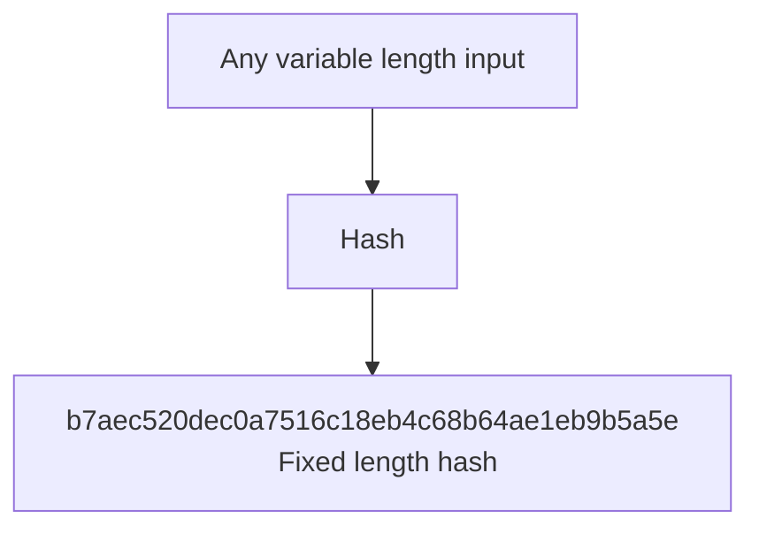
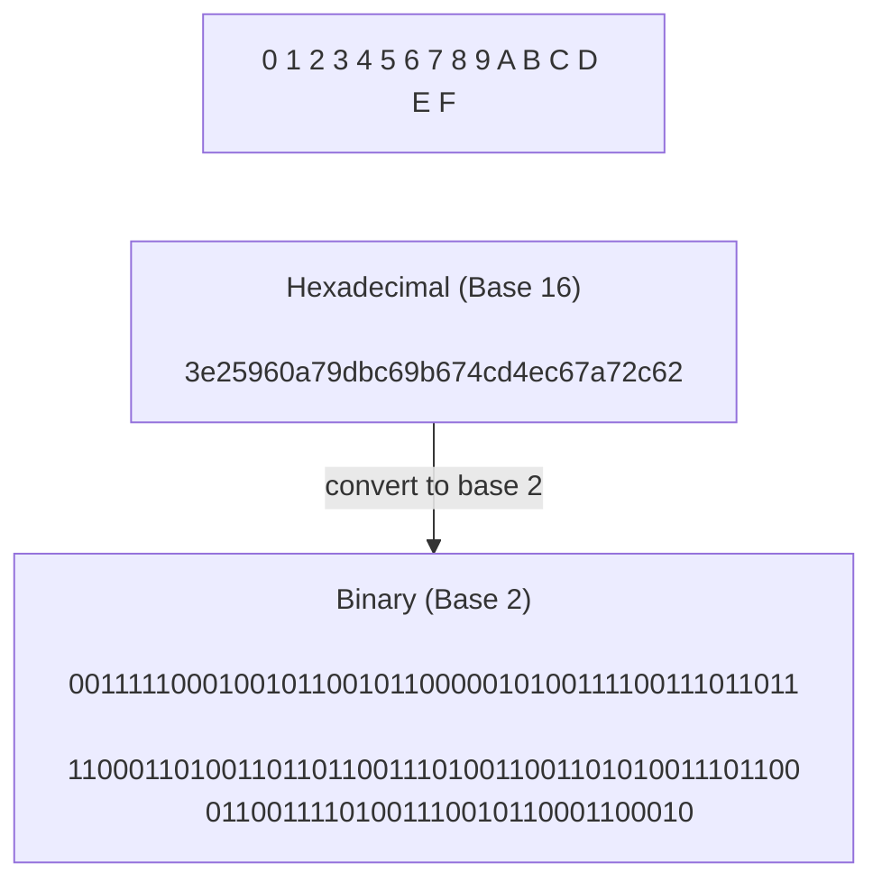
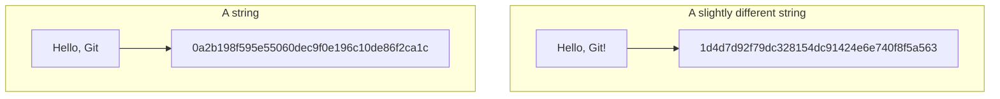
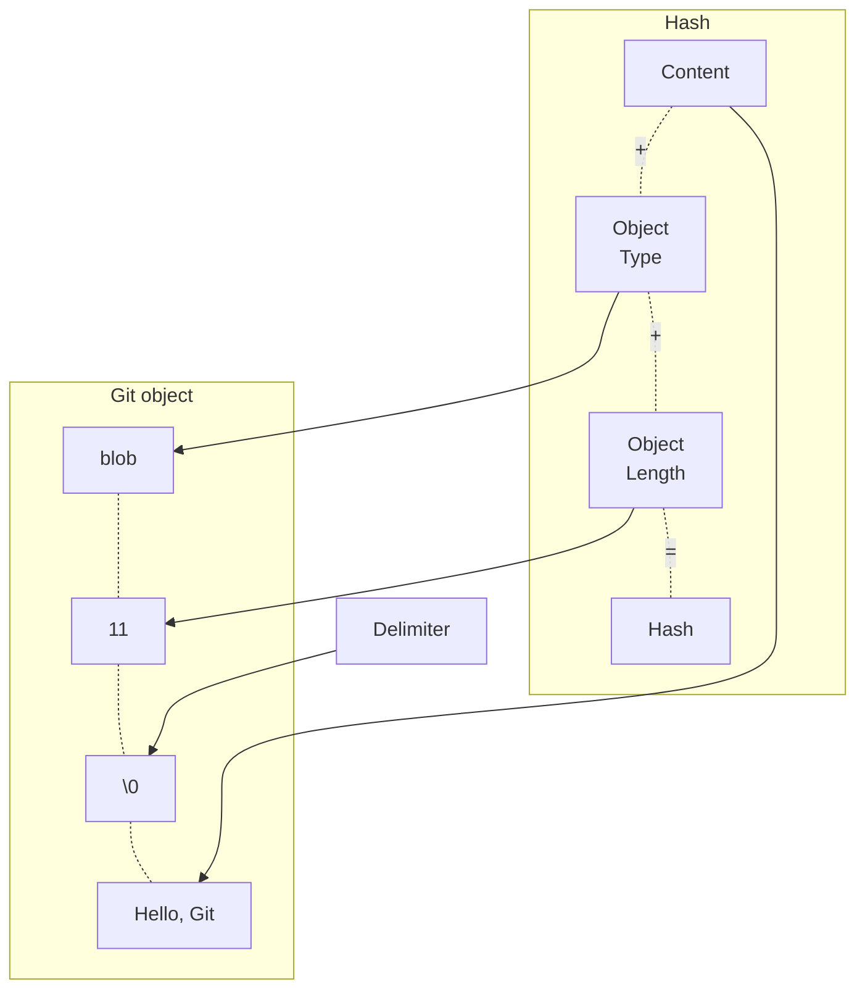
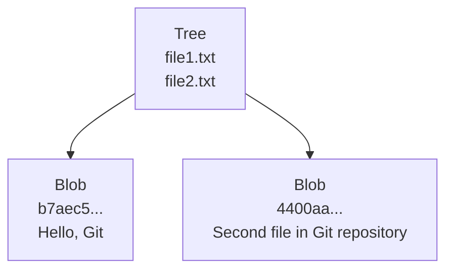
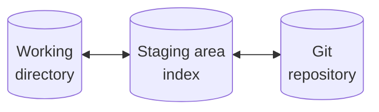
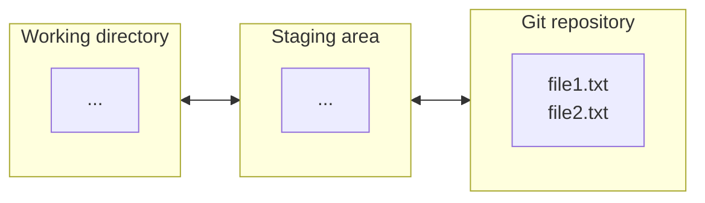
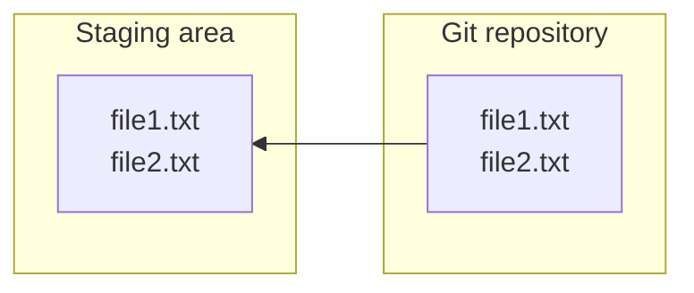
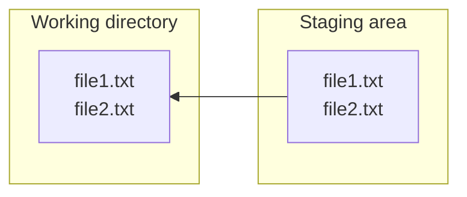

# Git under the hood

## Initializing a new Git repository

```bash

git init
```

After entering this command, a new hidden folder ".git" will be automatically created.

```bash
➜  Dev mkdir git_insights
➜  Dev cd git_insigths
➜  git_insights git init
hint: Using 'master' as the name for the initial branch. This default branch name
hint: is subject to change. To configure the initial branch name to use in all
hint: of your new repositories, which will suppress this warning, call:
hint: 
hint:   git config --global init.defaultBranch <name>
hint: 
hint: Names commonly chosen instead of 'master' are 'main', 'trunk' and
hint: 'development'. The just-created branch can be renamed via this command:
hint: 
hint:   git branch -m <name>
Initialized empty Git repository in /home/odoo/Dev/git_insights/.git/
```

Let's look at the directory now:

```bash
➜  git_insights git:(master) ls -la
total 16
drwxrwxr-x  3 odoo odoo 4096 déc 24 12:55 .
drwxrwxr-x 21 odoo odoo 4096 déc 24 12:53 ..
drwxrwxr-x  7 odoo odoo 4096 déc 24 12:55 .git
-rw-rw-r--  1 odoo odoo  718 déc 24 12:55 git_init.md
```

The hidden folder is there. `git:(master)` indicates that the directory is under
git control. The default branch is master. If you don't see your branch on the
prompt, please install zsh. It can save your life :)

Let's examine the content of `.git` folder managed by git.

```bash
➜  git_insights git:(master) cd .git
➜  .git git:(master) ls -la
total 40
drwxrwxr-x 7 odoo odoo 4096 déc 24 12:55 .
drwxrwxr-x 3 odoo odoo 4096 déc 24 12:55 ..
drwxrwxr-x 2 odoo odoo 4096 déc 24 12:55 branches
-rw-rw-r-- 1 odoo odoo   92 déc 24 12:55 config
-rw-rw-r-- 1 odoo odoo   73 déc 24 12:55 description
-rw-rw-r-- 1 odoo odoo   23 déc 24 12:55 HEAD
drwxrwxr-x 2 odoo odoo 4096 déc 24 12:55 hooks
drwxrwxr-x 2 odoo odoo 4096 déc 24 12:55 info
drwxrwxr-x 4 odoo odoo 4096 déc 24 12:55 objects
drwxrwxr-x 4 odoo odoo 4096 déc 24 12:55 refs
```

There are three files : `config`, `description` and `HEAD`

Let's read the content of `config` with the `cat` command
```bash
➜  .git git:(master) cat config
[core]
        repositoryformatversion = 0
        filemode = true
        bare = false
        logallrefupdates = true
```
It's the configuration of our git repository with some default settings.

Let's give a loog at the `description` file

```bash
➜  .git git:(master) cat description
Unnamed repository; edit this file 'description' to name the repository.
```

Let's finally have a look to `HEAD` file.

```bash
➜  .git git:(master) cat HEAD
ref: refs/heads/master
```

We'll explain later the meaning of this line of code.

In it's filesystem, Git stores objects, and all objects are stored in this folder, `objects`, at the moment, there are no objects because we have just initialized our new repository. There are several types of objects that Git can store, and let's talk about types of objects next.

```bash
➜  .git git:(master) cd objects
➜  objects git:(master) ls -la
total 16
drwxrwxr-x 4 odoo odoo 4096 déc 24 12:55 .
drwxrwxr-x 7 odoo odoo 4096 déc 24 12:55 ..
drwxrwxr-x 2 odoo odoo 4096 déc 24 12:55 info
drwxrwxr-x 2 odoo odoo 4096 déc 24 12:55 pack
```

## Git object types

- Blob : store files (text, video, images...)
- Tree : information about directories
- Commit : version of a project
- Annotated tag : persistent text pointer to a specific pointer

Those four object types allow Git to store all necessary data required for file tracking, for tracking of changes of files and so on.

Let's focus now on Blob (files) and Tree (folders).

We're gonna use low-level git commands : `git hash-object`, `git mktree` and `git cat-file`

With `git has-object`, we will be able to create a new object in the git structure.

With the help of `git cat-file` command, we'll be able to read the content of Git objects

## Write a new git object with git hash-object

Let's use the `echo` command in our terminal

```bash
➜  git_insights git:(master) echo "Hello, Git"
Hello, Git
```
Ok, so nothing very surprising...

Let's pipe (redirect) this command to `git hash-object` command with the option `--stdin` (standard input)

```bash
➜  git_insights git:(master) echo "Hello, Git" | git hash-object --stdin
b7aec520dec0a7516c18eb4c68b64ae1eb9b5a5e
```
That strange string of numbers and letters are the `hash` of the string `Hello, Git`

If you go in the object folder. It's still empty.

So now, let's add an option to our command:

```bash
➜  git_insights git:(master) echo "Hello, Git" | git hash-object --stdin -w
b7aec520dec0a7516c18eb4c68b64ae1eb9b5a5e
```

Let's take a look into the `objects` folder

```bash
➜  objects git:(master) ls -la 
total 20
drwxrwxr-x 5 odoo odoo 4096 déc 24 13:27 .
drwxrwxr-x 7 odoo odoo 4096 déc 24 12:55 ..
drwxrwxr-x 2 odoo odoo 4096 déc 24 13:27 b7
drwxrwxr-x 2 odoo odoo 4096 déc 24 12:55 info
drwxrwxr-x 2 odoo odoo 4096 déc 24 12:55 pack
```

A new folder has appeared named `b7`, the two first characters of the hash (b7aec52...)
let's open it up
```bash
➜  objects git:(master) cd b7
➜  b7 git:(master) ll
total 4,0K
-r--r--r-- 1 odoo odoo 27 déc 24 13:27 aec520dec0a7516c18eb4c68b64ae1eb9b5a5e
```
Notice that the name of the only file in this directory is the remaining hash of the object we've created

`Folder name` + `File name` = `Hash` !!!

The new file was created only in the git repository `.git/objects` folder. Our porject folder is still empty.



## What is hash function?

Git database stores files with their hash.

Hash Function is a function that takes any variable length input and creates fixed length hash. Independent of the input, this hash length will be always fixed. 

If you know the hash, but don't know input, you are not able to create this input based on hash, and such functions are called one-way functions. We are able to create hash based on input, but we are not able to find out which input was used to create specific hash, that's why very often passwords that you are entering on any website are stored in databases as hashes, and when you enter each time your password, when you are logging into any website or application. Again, hash is created from your password and only hashes are compared, because hash functions will always generate same hash from the same input.

Summary :

1. Hash function is one-way function.
2. The same input will always produce the same hash.

## Hash function overview

Several popular hash functions exist :

- MD5 (128 bits)
- SHA1 (160 bits)
- SHA256 (256 bits)
- SHA384 (384 bits)
- SHA512 (512 bits)

For example let's compare MD5 and SHA1 hash function for the same string:

```bash
➜  b7 git:(master) echo -n 'Hello world' | md5sum
3e25960a79dbc69b674cd4ec67a72c62  -
➜  b7 git:(master) echo -n 'Hello world' | sha1sum
7b502c3a1f48c8609ae212cdfb639dee39673f5e  -
```

The SHA1 hash is longer (160 bits) thant the MD5 (128)

Let's try SHA512...
```bash
➜  b7 git:(master) echo -n 'Hello world' | sha512sum
b7f783baed8297f0db917462184ff4f08e69c2d5e5f79a942600f9725f58ce1f29c18139bf80b06c0fff2bdd34738452ecf40c488c22a7e3d80cdf6f9c1c0d47  -
```

## SHA-1 hash function

Git utilizes SHA1 function (160 bits long) in hexadecimal format.

The length of the SHA-1 hash is 160 bits, so 40 hexadecimal characters.



Let's see different hashes


There is only a small difference between the two strings, but the resulting hashes are completely different.

This is a very important characterisitic of a hash function. It's really hard to guess input based on hash, if you don't know the input.

With the terminal ?

```bash
➜  b7 git:(master) echo -n 'Hello, Git' | sha1sum
0a2b198f595e55060dec9f0e196c10de86f2ca1c  -
➜  b7 git:(master) echo -n 'Hello, Git!' | sha1sum
1d4d7d92f79dc328154dc91424e6e740f8f5a563  -
```

Don't forget to add the `-n` option to avoid the line break at the end of the string. Ohterwise you'll have a totally different hash

```bash
➜  b7 git:(master) echo -n 'Hello, Git!' | sha1sum
1d4d7d92f79dc328154dc91424e6e740f8f5a563  -
➜  b7 git:(master) echo 'Hello, Git!' | sha1sum 
e40153b3e43a5ed7fa00ce6bd7a576763b88dab2  -
```

With `zsh` you'll see that there is no line break at the end of the text with the help of `%` character :

```shell
➜  b7 git:(master) echo -n "Hello Git"
Hello Git%
```

Now, you know, another important feature of every hash function : even small change in input data will lead to completely different hash.

## How many files Git can store in the same repository?

2^160 = 1461501637330902918203684832716283019655932542976 possibilities...

So you're probably safe!

## What is the chance of producing same hash for different files?

The probablity of any same SHA1 hash on any pair of N files (so called hash collision) is :

$$1 - {(2^{160-1})! \over (2^{160-N})!\ 2^{160\ (N-1)}}$$

For `N = 2`, the answer is `6.84e-49`
For `N = 3`, the answer is `2.05e-48`

Probability of the hash collision grows with the number of files in the repository.

That means the probability of hash collision in Git repository is very-very-very small. It will almost never happen in any of the repositories in the world.

## Exploring git objects with git cat-file command

Here the options of `git cat-file`

- `git cat-file -p <hash>` Content of the object
- `git cat-file -s <hash>` Size of the object
- `git cat-file -t <hash>` Type of the object

We have for the moment one object in our repository with this hash : `b7aec520dec0a7516c18eb4c68b64ae1eb9b5a5e`

So let's try the new git command with `-p`

```bash
➜  git_insights git:(master) git cat-file -p b7aec520dec0a7516c18eb4c68b64ae1eb9b5a5e
Hello, Git
```

With `-t` option to see what type of object it is:

```bash
➜  git_insights git:(master) git cat-file -t b7aec520dec0a7516c18eb4c68b64ae1eb9b5a5e
blob
```

And now with the `-s` option:

```bash
➜  git_insights git:(master) git cat-file -s b7aec520dec0a7516c18eb4c68b64ae1eb9b5a5e
11
```
Eleven bytes? Yeah, there is a line break at the end of the string :)

## Creating a new git blob based on a file

To create a git object from a file, we use this command:

`git hash-object <filename> -w`

Let's create a file outside of our repository from our terminal

```bash
➜  git_insights git:(master) cd ..
➜  Dev echo "Second file in Git repository" > new-file.txt
➜  Dev ls -la
drwxrwxr-x  21 odoo odoo  4096 déc 25 11:38  .
drwxr-x---  43 odoo odoo  4096 déc 25 11:38  ..
drwxrwxr-x   3 odoo odoo  4096 déc 25 11:38  git_insights
-rw-rw-r--   1 odoo odoo    30 déc 25 11:38  new-file.txt
```

We can of course list the contents of this file:

```bash
➜  Dev cat new-file.txt 
Second file in Git repository
```

Let's go back in our git repository and create a git object based on this new file.

```bash
➜  Dev cd git_insights 
➜  git_insights git:(master) git hash-object ../new-file.txt   
4400aae52a27341314f423095846b1f215a7cf08
```

Without the `-w` option, no new object is created. As you can see in the `objects` folder:

```bash
➜  git_insights git:(master) ls .git/objects -la 
total 20
drwxrwxr-x 5 odoo odoo 4096 déc 24 13:27 .
drwxrwxr-x 7 odoo odoo 4096 déc 24 12:55 ..
drwxrwxr-x 2 odoo odoo 4096 déc 24 13:27 b7
drwxrwxr-x 2 odoo odoo 4096 déc 24 12:55 info
drwxrwxr-x 2 odoo odoo 4096 déc 24 12:55 pack
```

Let's add the option `-w` to our command

```bash
➜  git_insights git:(master) git hash-object ../new-file.txt -w
4400aae52a27341314f423095846b1f215a7cf08
➜  objects git:(master) ls -la
total 24
drwxrwxr-x 6 odoo odoo 4096 déc 25 11:45 .
drwxrwxr-x 7 odoo odoo 4096 déc 24 12:55 ..
drwxrwxr-x 2 odoo odoo 4096 déc 25 11:45 44
drwxrwxr-x 2 odoo odoo 4096 déc 24 13:27 b7
drwxrwxr-x 2 odoo odoo 4096 déc 24 12:55 info
drwxrwxr-x 2 odoo odoo 4096 déc 24 12:55 pack
```

A brand new folder named `44` is created that matches the two first characters of the hash. And inside
the folder, a file as expected with the remaining characters of the hash.

```bash
➜  44 git:(master) ls -la
total 12
drwxrwxr-x 2 odoo odoo 4096 déc 25 11:45 .
drwxrwxr-x 6 odoo odoo 4096 déc 25 11:45 ..
-r--r--r-- 1 odoo odoo   46 déc 25 11:45 00aae52a27341314f423095846b1f215a7cf08
```

Now we have two objects in our git repository. Let's try to read contents of this new object.

```bash
➜  44 git:(master) git cat-file -p 4400aae52a27341314f423095846b1f215a7cf08
Second file in Git repository
➜  44 git:(master) git cat-file -t 4400aae52a27341314f423095846b1f215a7cf08
blob
➜  44 git:(master) git cat-file -s 4400aae52a27341314f423095846b1f215a7cf08
30
```

We see that the size of the file is 30 and his type is `blob` as expected.

We can now remove the file in the parent folder. Let's do that.

```bash
➜  git_insights git:(master) cd ..
➜  Dev rm new-file.txt 
```

But the object in our repository is still here:

```bash
➜  Dev cd git_insights 
➜  git_insights git:(master) cd .git/objects
➜  objects git:(master) ls -la
total 24
drwxrwxr-x 6 odoo odoo 4096 déc 25 11:45 .
drwxrwxr-x 7 odoo odoo 4096 déc 24 12:55 ..
drwxrwxr-x 2 odoo odoo 4096 déc 25 11:45 44
drwxrwxr-x 2 odoo odoo 4096 déc 24 13:27 b7
drwxrwxr-x 2 odoo odoo 4096 déc 24 12:55 info
drwxrwxr-x 2 odoo odoo 4096 déc 24 12:55 pack
```

So, git repository stores files independently in its own `file system` in the `objects` directory

> Weird thing... when we were using the `echo "Hello, Git" | git hash-object --stdin -w`, we didn't specify a file name. 
> That's because **Git blobs don't have file names!**

## Git blobs do not store file names

`git cat-file` doesn't have an option to retrieve file name from the `blob` because blobs doesn't store file name of the original file.

But where size and type are strored in Git?

The answer is pretty straightforward. Theses informations are stored directly inside the git blob.

> Git genreates SHA-1 hash based on the input + type + size



Git object consists of four fields, object type, object length, delimiter and content; and here you see example of the blob. Here, object type is blob, object length is 11. You see a delimiter, it is actually null character and is written as \0 and after that comes content. And in our database, in our first project, we have such object. Type blob, object length is 11 and content Hello, Git; and it doesn't matter how this object is created. There are always only four fields inside of actual Git object in Git database.

Can we prove it? Yes we can. Follow me:

```bash
➜  b7 git:(master) echo "blob 11\0Hello, Git" | shasum
b7aec520dec0a7516c18eb4c68b64ae1eb9b5a5e  -
```

That's the correct SHA-1 hash!

> If you don't use `zsh` shell, add the `-e` option to the echo command to escape the 0 character

Let's see what's the content of our git object.
```bash
➜  git_insights git:(master) cd .git/objects/b7
➜  b7 git:(master) ls -la
total 12
drwxrwxr-x 2 odoo odoo 4096 déc 24 13:27 .
drwxrwxr-x 6 odoo odoo 4096 déc 25 11:45 ..
-r--r--r-- 1 odoo odoo   27 déc 24 13:27 aec520dec0a7516c18eb4c68b64ae1eb9b5a5e
➜  b7 git:(master) cat aec520dec0a7516c18eb4c68b64ae1eb9b5a5e 
xK��OR04d�H����Qp�,�9��% 
```

Oops! This is expected because Git store objects in a compressed binary format.

But with the `zlib` library in python we can do that:

```python
➜  b7 git:(master) python3
Python 3.10.12 (main, Nov 20 2023, 15:14:05) [GCC 11.4.0] on linux
Type "help", "copyright", "credits" or "license" for more information.
>>> import zlib
>>> filename = "aec520dec0a7516c18eb4c68b64ae1eb9b5a5e"
>>> compressed_contents = open(filename, 'rb').read()
>>> decompressed_contents = zlib.decompress(compressed_contents)
>>> decompressed_contents
b'blob 11\x00Hello, Git\n'
>>> 
```

We have exactly the same content that was previously said: type + length + delimiter + content

> Filenames for the blobs are stored in trees

## Tree objects in git

Here is an exemple of a tree object :
```bash
100644 blob 887ae9333d92a1d72400c210546e28baa1050e44    file1  
040000 tree ab39965d17996be2116fe508faaf9269e903c85b    folder1
```

You can see for each line :
- the permission of the object
- the type of the object (blob or tree if there is a child folder)
- the hash corresponding to the object in the folder `object`
- and the name of the file or folder

So we don't need the name of the file in the git object, the file name is in the tree object.

## Git object permissions

Here are the most usual permissions

| Permission | Description |
| ----------- | ----------- |
| 040000      | Directory   |
| 100644      | Regular non executable file |
| 100664      | Regular non executable group-writeable file |
| 100755      | Regular executable file |
| 120000      | Symbolic link |
| 160000      | Git link |

Most of the time you'll see the two first ones (040000 and 100644).

## Create git tree object

Let's see what we want to do. We have two git objects at the moment.



We don't use complete SHA-1 hash, but only the 5 or 6 first characters that clearly identify them.

We're gonna create a tree object with two entries, each entry is a blob (a file) with a permission 100644 that corresponds to a regular non executable file, we'll add their corresponding SHA-1 hash and the name of each file (here file1.txt and file2.txt).

It means that our tree object have to be :

```bash
100644 blob b7aec520dec0a7516c18eb4c68b64ae1eb9b5a5e    file1.txt 
100644 blob 4400aae52a27341314f423095846b1f215a7cf08    file2.txt
```
Be aware that there is a tab character between the hash and the name of the file
Let's create it with the low-level git command `git mktree`

Go to the root of your repository and find our files in the .git/objects folder

```bash
➜  git_insights git:(master) find .git/objects -type f 
.git/objects/b7/aec520dec0a7516c18eb4c68b64ae1eb9b5a5e
.git/objects/44/00aae52a27341314f423095846b1f215a7cf08
```

Ok, we have our hashes that we want to put in our tree. We're gonna pipe a temporary text file into the command `git mktree` and to do it without confusing, we'll create our file outside our repository.

```bash
➜  git_insights git:(master) cd ..
➜  Dev touch temp-tree.txt                                                                    
➜  Dev echo "100644 blob b7aec520dec0a7516c18eb4c68b64ae1eb9b5a5e\tfile1.txt" >> temp-tree.txt 
➜  Dev echo "100644 blob 4400aae52a27341314f423095846b1f215a7cf08\tfile2.txt" >> temp-tree.txt
➜  Dev cat temp-tree.txt
100644 blob b7aec520dec0a7516c18eb4c68b64ae1eb9b5a5e file1.txt
100644 blob 4400aae52a27341314f423095846b1f215a7cf08 file2.txt
➜  Dev cd git_insights 
➜  git_insights git:(master) cat ../temp-tree.txt | git mktree
3b95df0ac6365c72e9b0ff6c449645c87e6e1159
```
We have now the SHA-1 hash of our new tree Git object! We can see it now in the objects folder

```bash
➜  objects git:(master) ls -la
total 28
drwxrwxr-x 7 odoo odoo 4096 déc 26 09:00 .
drwxrwxr-x 7 odoo odoo 4096 déc 24 12:55 ..
drwxrwxr-x 2 odoo odoo 4096 déc 26 09:00 3b    <------
drwxrwxr-x 2 odoo odoo 4096 déc 25 11:45 44
drwxrwxr-x 2 odoo odoo 4096 déc 24 13:27 b7
drwxrwxr-x 2 odoo odoo 4096 déc 24 12:55 info
drwxrwxr-x 2 odoo odoo 4096 déc 24 12:55 pack
```

We can now remove our `temp-tree.txt`

```bash
➜  git_insights git:(master) rm ../temp-tree.txt 
➜  git_insights git:(master) 
```

Let's examine our brand new git tree object

First of all, let list our objects in the .git/objects folder

```bash
➜  git_insights git:(master) find .git/objects -type f
.git/objects/3b/95df0ac6365c72e9b0ff6c449645c87e6e1159
.git/objects/b7/aec520dec0a7516c18eb4c68b64ae1eb9b5a5e
.git/objects/44/00aae52a27341314f423095846b1f215a7cf08
```

Let's use `git cat-file` to print the content of our tree object

```bash
➜  git_insights git:(master) git cat-file 3b95df -p
100644 blob b7aec520dec0a7516c18eb4c68b64ae1eb9b5a5e    file1.txt
100644 blob 4400aae52a27341314f423095846b1f215a7cf08    file2.txt
➜  git_insights git:(master) git cat-file 3b95df -t
tree
➜  git_insights git:(master) git cat-file 3b95df -s
74
```

Notice here that I used only the 6 first characters of the hash because it clearly indicate the hash unequivocally

Ok, so far we've created two blobs and a tree in our git repository without using `git add`, but only with the low-level commands `git mktree`, `git hash-object -w`.

Let's move on and discuss how to retrieve files from Git repository and put them into a special area called staging area or index.

## Working directory, Staging area, and Git repository



There are actually three main areas where files and folders.
- **Git repository** (where the tree and the two blobs are)
- **Staging area** or index. Responsible for preparing files to be inserted into git repository. And in the other way, preparing files taken from Git repository to be put into working directory. Putting files in the staging area is a mandatory step in all Git operations, either you want to put files from working directory into git repository or when you want to read files from Git repository and check out them into your working directory.
- **Working directory** : your local directory where you're working

We have currently into our git repository three objects, a tree object with two pointers towards two blobs (files). Our tree object is the root directory of our git repository because no other tree points to this tree. Don't forget that every object in our git repository has its own SHA-1 hash.

Let's examine our working directory

```bash
➜  git_insights git:(master) ls -la
total 36
drwxrwxr-x  3 odoo odoo  4096 déc 25 11:38 .
drwxrwxr-x 22 odoo odoo  4096 déc 26 09:05 ..
drwxrwxr-x  7 odoo odoo  4096 déc 24 12:55 .git
```
It's empty. There are no files or folders except the hidden directory `.git` (our git repository)

Now examine our staging area. For that, a special command is here for us : `git ls-files`

```bash
➜  git_insights git:(master) git ls-files -s
➜  git_insights git:(master) 
```

You can see that now the index is empty. There are no files in our staging area.

So we can represent now our current files distribution in this following way :



It's time to put this file from git repository to the staging area (or index)

To do that we should use the `git read-tree <hash>` command.



Let's do that in our terminal, but first of all let's list our objects in the `.git/objects` folder

```bash
➜  git_insights git:(master) find .git/objects -type f
.git/objects/3b/95df0ac6365c72e9b0ff6c449645c87e6e1159
.git/objects/b7/aec520dec0a7516c18eb4c68b64ae1eb9b5a5e
.git/objects/44/00aae52a27341314f423095846b1f215a7cf08
```

We know that our tree object is the first one with the hash 3b95df...

```bash
➜  git_insights git:(master) ✗ git read-tree 3b95df
```

Nothing happens! But we see a yellow cross in the command prompt. That means that we have some files in our staging area.

Let's use git `ls-files` to see the contents of our staging area.

```bash
➜  git_insights git:(master) ✗ git ls-files
file1.txt
file2.txt
```

With the option `-s` we can see those files in a table format (permission, hash, status, filename):

```bash
➜  git_insights git:(master) ✗ git ls-files -s
100644 b7aec520dec0a7516c18eb4c68b64ae1eb9b5a5e 0       file1.txt
100644 4400aae52a27341314f423095846b1f215a7cf08 0       file2.txt
```

The status here is `0` for each file. That means that the files are the same as in the git repository.

Now it's time to put the files in staging area into the working directory.

## Git checkout-index

We will use a new git command `git checkout-index` with the option `-a` to check-out all files that are in the staging 
area.

```bash
➜  git_insights git:(master) ✗ ls
➜  git_insights git:(master) ✗ git checkout-index -a
➜  git_insights git:(master) ✗ ls
file1.txt  file2.txt
```
Now we can use `cat`` command to print the contents of our files.

```bash
➜  git_insights git:(master) ✗ cat file1.txt
Hello, Git
➜  git_insights git:(master) ✗ cat file2.txt 
Second file in Git repository
```
We have finally complete the entire process of retrieving files from git repository and putting them in the working directory. And this... manually.



And if we use the known command `git status`:

```bash
➜  git_insights git:(master) ✗ git status
On branch master

No commits yet

Changes to be committed:
  (use "git rm --cached <file>..." to unstage)
        new file:   file1.txt
        new file:   file2.txt
```